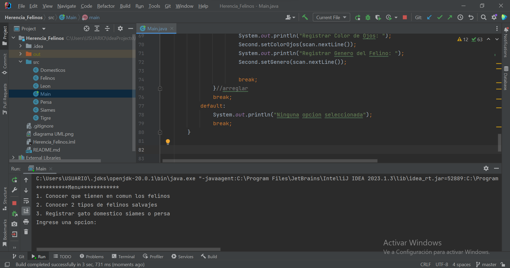
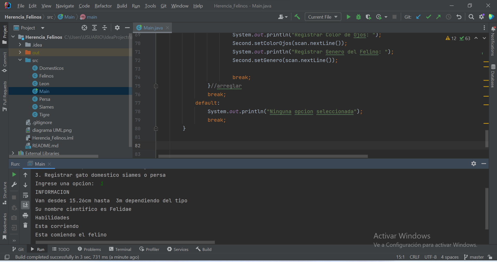
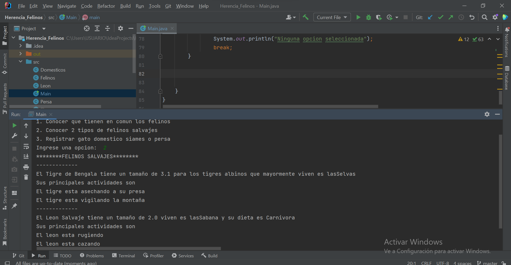
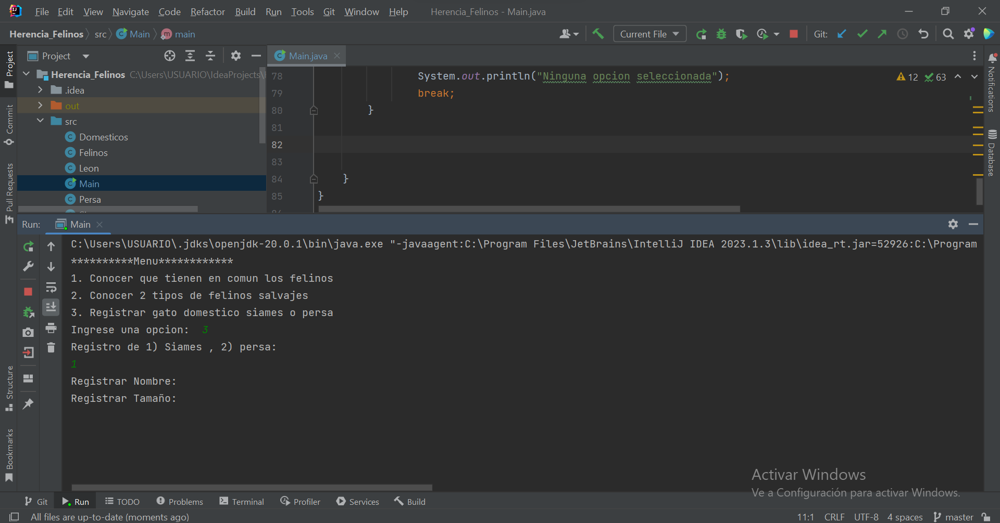

# Herencia_Felinos
El proyecto presentaraa informacion relevante de algunos felinos y tambien prodra registrar dos tipos de gatos domesticos y saber cuales son sus hablidades principales. 

## Diagrama UML con las respectivas herencias 

## Menu

## caso 1  

## caso 2 

## caso 3

## ningun caso 
